# Fantasy Asset Forge

Code-first 3D game assets, with 2D pixel-art sprites rendered from the same model.

An LLM writes each asset as a TypeScript program, renders it, looks at the result, and revises
it. There is no Blender in the loop. A textured, rigged, animated GLB comes out of every build,
and the sprite pass renders that GLB into eight-direction pixel art, one sheet per animation
clip and one sprite set per color preset. You get a 3D asset and a 2.5D sprite character from
one source file.

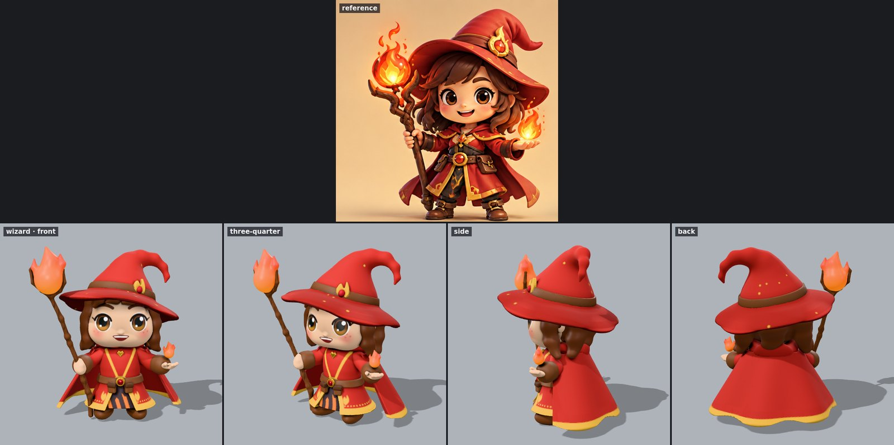

## Showcase

Everything below was rendered by `./forge` from the code in `assets/`. Nothing was hand-painted
or retouched.

### Turnarounds

Each render sits under the concept reference it was modeled from.


### 3D clips and their sprites

Each row is one clip. The left column is the textured GLB in the studio renderer; the right
column is the pixel-art sprite of the same frames.

| Character                                             |                                                 3D (GLB)                                                 |                                                    Sprite (128 px, SE)                                                     |
| ----------------------------------------------------- | :------------------------------------------------------------------------------------------------------: | :------------------------------------------------------------------------------------------------------------------------: |
| **Wizard**<br>`attack2`: palm-flame cast              |       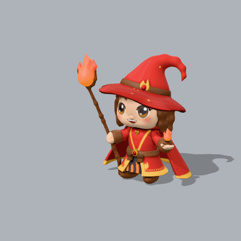       |       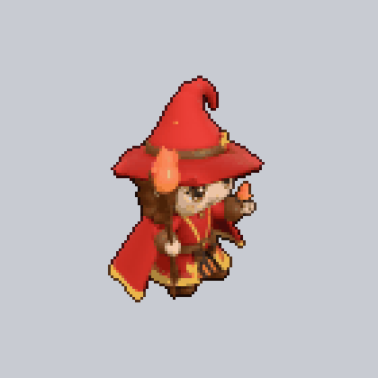       |
| **Rogue**<br>`attack`: reverse-grip twin-dagger combo | 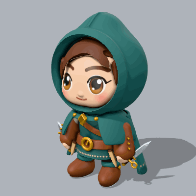 | 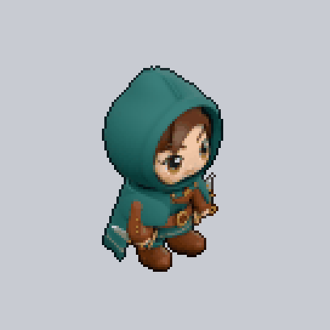 |
| **Knight**<br>`attack2`: shield bash                  |         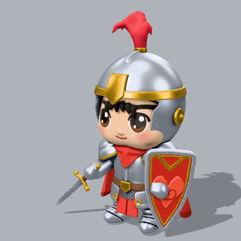         |         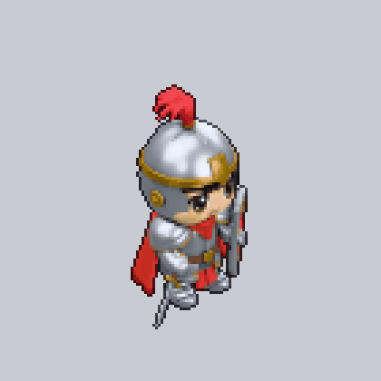         |
| **Druid**<br>`attack`: staff cast                     |           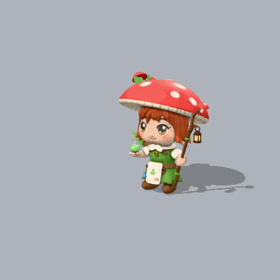           |           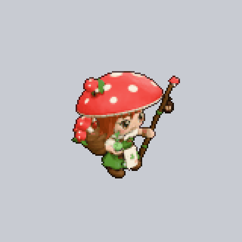           |
| **Orc warrior**<br>`roar`: roar                       |         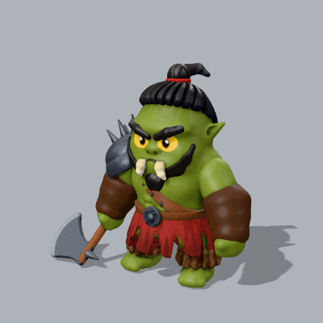         |         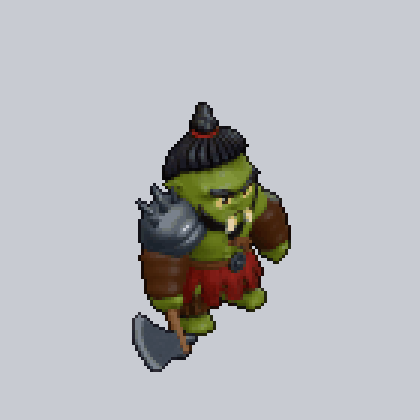         |
| **Skeleton**<br>`death`: collapsing death             |     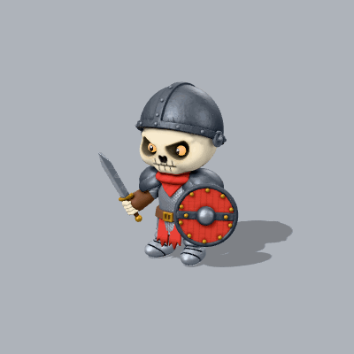      |     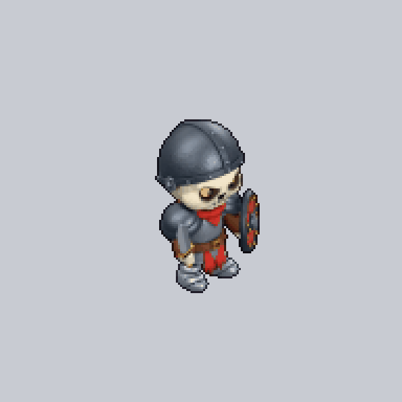      |
| **Dire wolf**<br>`howl`: howl                         |           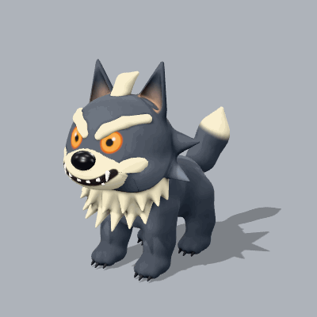           |           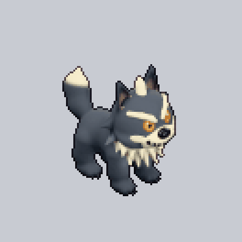           |
| **Giant spider**<br>`attack`: rearing bite            |   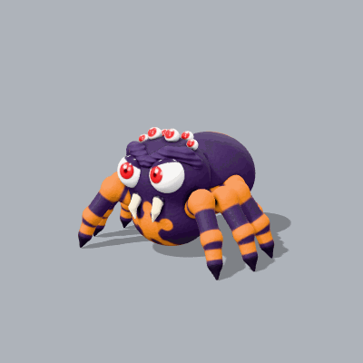   |   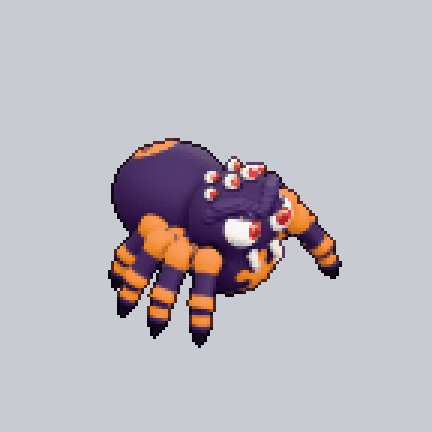   |
| **Fire dragon**<br>`roar`: roar                       |         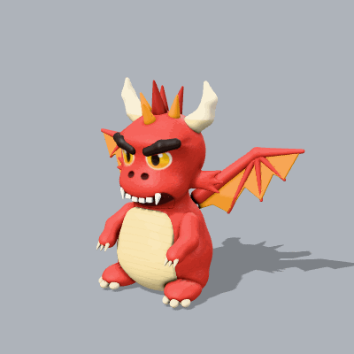         |         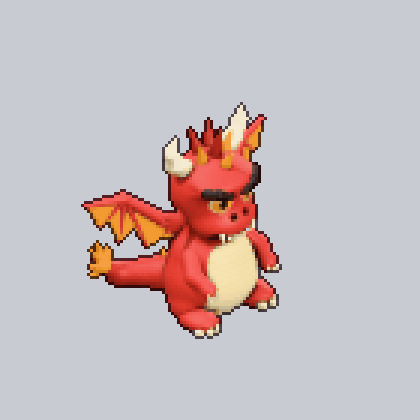         |
| **Slime**<br>`spit`: spit                             |               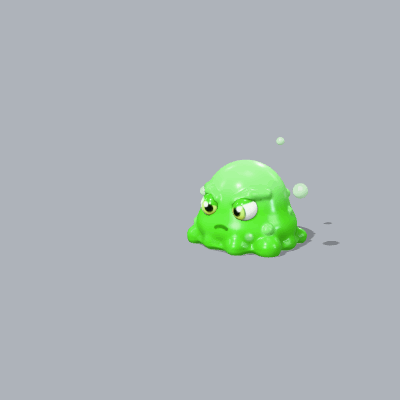               |               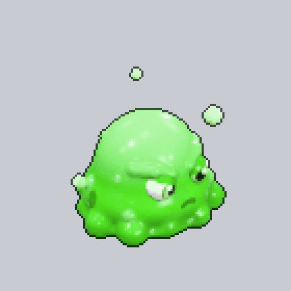               |

### Eight directions

Every clip is baked for all eight directions at a fixed pixel density and ground pivot, so
characters line up on a tile grid. This is the rogue's twin-dagger attack:

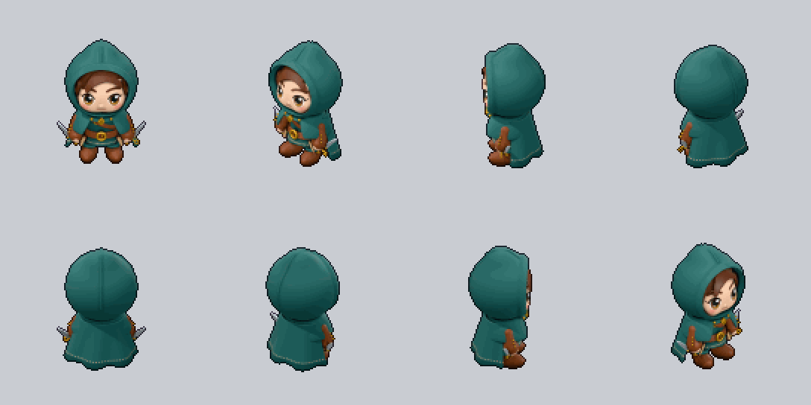

### Color variants

Characters declare color slots (eyes, hair, skin, clothing, or a creature's scales and horns)
and named presets. A textured build adds a tint mask and one recolored texture per preset to
the GLB, and `forge all` bakes a full sprite set per preset. See
[docs/color-variants.md](docs/color-variants.md).

**Wizard**: default, frost, mystic, sage

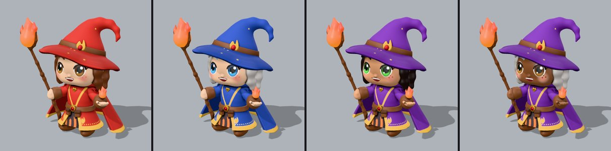

**Rogue**: default, noble, nomad, ranger (front)

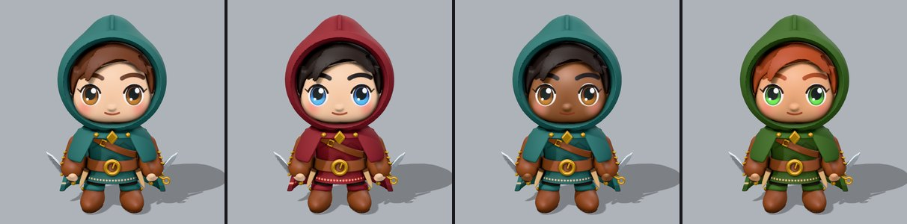

**Knight**: default, champion, royal, warden

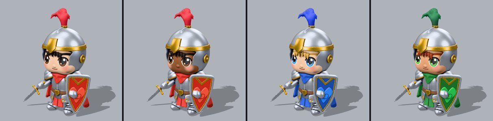

**Druid**: default, autumn, grove, heath

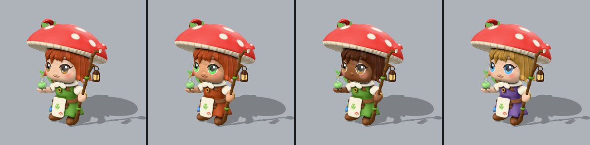

**Orc warrior**: default, ashen, bloodfang, bog

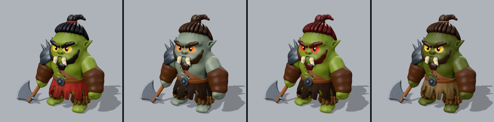

**Skeleton**: default, barrow, dread, rustbone

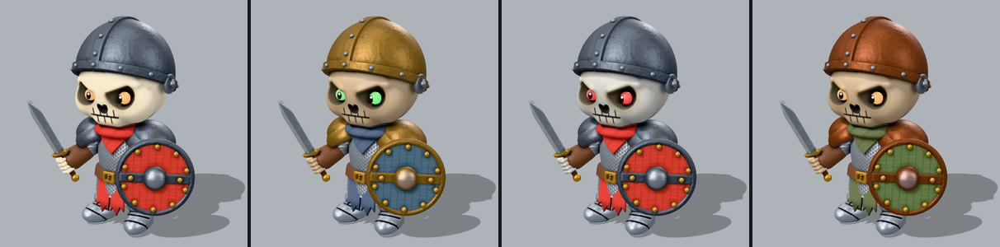

**Dire wolf**: default, frost, shadow, timber

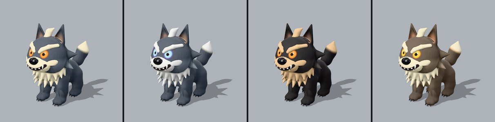

**Giant spider**: default, cave, tomb, widow

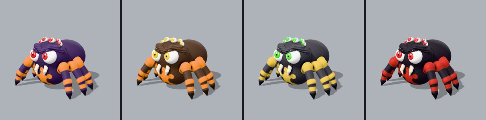

**Fire dragon**: default, copper, ember, magma

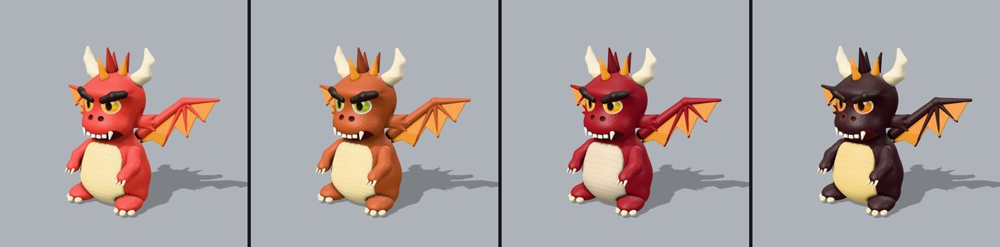

**Slime**: default, fire, ice, poison

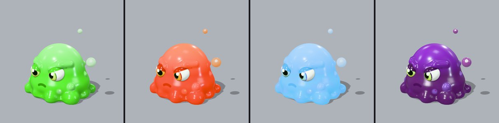

## Quick start

```bash
pnpm install
./forge render rogue --fast         # quick shape check: out/rogue/render.png
./forge all rogue                   # final: textured GLB, turnaround, sprites, every animation
pnpm dev                            # interactive viewer at http://127.0.0.1:5173 (orbit, clips, rebuild on save)
```

Assets live in `assets/*.ts`: heroes, NPCs, monsters, wildlife, props, vegetation, buildings,
and terrain tiles. Good starting points, one per category: `rogue` (character), `horned-boar`
(creature), `treasure-chest` and `barrel` (props), `oak-tree` (vegetation), `cottage`
(architecture), `knight-sword` (item).

- [AGENTS.md](AGENTS.md): the authoring loop and the API. Coding agents read it automatically.
- [.claude/skills/forge-assets](.claude/skills/forge-assets/SKILL.md): the asset-creation skill
  (process, art direction, category playbooks, rigging and animation, review rubric).
- [.claude/skills/forge-environments](.claude/skills/forge-environments/SKILL.md): building a
  whole environment kit (asset list, mockup, review, asset batch, sample map).
- [bench/](bench/README.md): Forge Bench, which measures how well models make assets with Forge.

## How it works

```
assets/rogue.ts ─build─▶ SDF bodies ─mesh─▶ medium-poly meshes ─unwrap─▶ UV atlas ─bake─▶ textures
  (code)                (closures)   surface nets,       xatlas          base color, normal,
                                     reduction           (one atlas)     AO/rough/metal, tint mask
                                                                          │
                     skeleton + bone tags ─▶ skin weights, clips ─────────┤
                                                                          ▼
                                                             out/rogue/rogue.glb
                                                               ├─▶ render.png (studio turnaround)
                                                               ├─▶ anim/ (3D review strips, GIFs)
                                                               ├─▶ sprites/ (8-direction pixel art per clip)
                                                               ├─▶ sprites/presets/ (the same per color preset)
                                                               └─▶ inspect.md (numbers for blind checks)
```

- **Modeling** (`src/sdf/`): shapes, cubic smooth booleans, transforms, 2D profiles (revolve,
  extrude, arcs), noise (gradient, fbm, Worley), paint stencils, bone tags, and surface probes
  (`raycast`, `surfacePoint`) for attaching details exactly.
- **Meshing** (`src/sdf/mesher.ts`): hierarchical narrow band, surface nets, vertices snapped to
  the true surface, normals from the field gradient, checked triangle reduction (meshoptimizer),
  parallel worker threads.
- **Textures** (`src/texture/`): one xatlas UV atlas for all bodies; every texel is projected
  onto the true surface and baked: anti-aliased paint, a tangent-space normal map encoded in the
  exact frame the shader uses (so bake-only `bump` detail and smooth curvature survive
  reduction), SDF ambient occlusion, per-body roughness and metalness, and a tint mask for
  color variants.
- **Rigging and animation** (`src/rig.ts`, `src/motion.ts`): skeletons from joint positions,
  skin weights from the distance to bone-tagged parts, clips written as `pose(t, phase)`
  functions with gait and planted-foot helpers, exported as glTF animations. Characters carry
  idle, walk, run, attack, hit, and death, plus their own extras (shield bash, roar, howl, spit,
  victory).
- **Export** (`src/gltf.ts`): GLB with named nodes, PBR materials, embedded PNG textures,
  tangents, skins, animations, and `KHR_materials_variants` for color presets.
- **Rendering** (`src/render/`): headless Chromium; image-based light, a camera-relative
  key/fill/rim rig, shadows; turnarounds, animation strips and GIFs, pixel-art sprites
  (supersampled, binary alpha, one pixel density per character, a fixed ground pivot, optional
  shared palette and outline), and an ID-buffer inspection.

## Commands

| Command                                                          | Output                                                                  |
| ---------------------------------------------------------------- | ----------------------------------------------------------------------- |
| `./forge build <asset>`                                          | `<asset>.glb`, `stats.json`, `textures/`                                |
| `./forge render <asset> [--fast] [--views …] [--focus x,y,z,r]`  | `render.png`, `views/`                                                  |
| `./forge render <asset> --preset <name>\|all`                    | `render.<preset>.png`, `views/presets/<preset>/`                        |
| `./forge inspect <asset>`                                        | `inspect.md`: visibility per part, silhouette, values, colors, warnings |
| `./forge animate <asset> [--clip walk]`                          | `anim/<clip>.png` strip and `.gif`                                      |
| `./forge sprites <asset> [--clip walk] [--dirs 8] [--colors 24]` | `sprites/` frames, sheet, preview, GIF                                  |
| `./forge check <asset>`                                          | clip clearance: held weapons never pass through the head                |
| `./forge all <asset>`                                            | everything above, including sprites for every clip and preset           |
| `pnpm dev`                                                       | viewer with orbit, wireframe, clip playback                             |
| `pnpm check`                                                     | typecheck and tests                                                     |

`--fast` skips UV unwrapping and baking (vertex colors, about 3x faster) for shape iteration.

## Scope

In: characters, creatures, props, vegetation, architecture, terrain tiles, and items in a
stylized chibi, medium-poly look (a full-quality hero is about 40k to 70k triangles), baked
textures, color variants, skeletal rigs, animation clips, GLB, and eight-direction pixel-art
sprites.

Not yet: image-texture projection (textures are baked from code, not painted from files), LODs,
blend shapes, inverse kinematics, and engine-specific exporters.

## History

Version 0.1 tried to make LLM asset creation reliable by giving the LLM a closed catalog of parts
and patch operations. The LLM could only rearrange what already existed, and new shapes needed
product code changes. Its last commit is `5d03ddd`. This rebuild keeps the loop that
makes the Blender workflow succeed (the LLM writes geometry code and looks at the result) and
replaces only the runtime.
