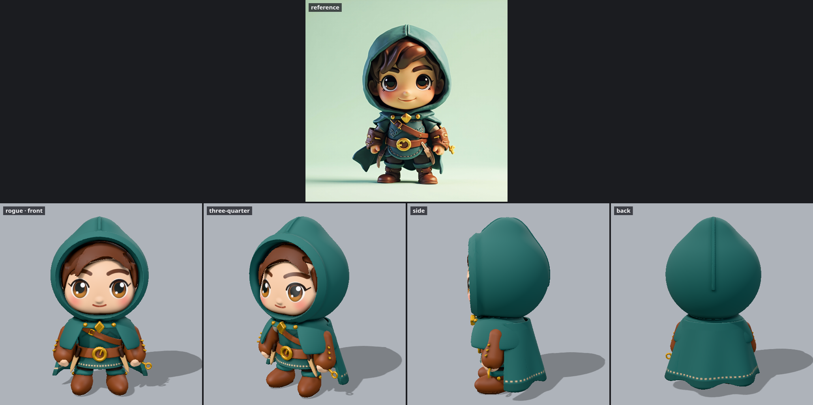

# Fantasy Asset Forge

An LLM writes a 3D game asset as code, looks at the render, and improves it. There is no Blender
in the loop. Forge gives the model an expressive modeling language (signed distance fields with
smooth blending, profiles, displacement, surface probes, and 3D paint), a mesher that turns it
into clean medium-poly geometry, UV unwrapping and texture baking, rigging and animation, a
studio renderer, GLB export, and a derived pixel-art sprite pass.

3D is the primary output. Sprites are rendered from the same GLB.



## Quick start

```bash
pnpm install
./forge render rogue --fast         # quick shape check: out/rogue/render.png
./forge all rogue                   # final: textured GLB, turnaround, sprites, every animation
pnpm dev                            # interactive viewer at http://127.0.0.1:5173 (orbit, clips, rebuild on save)
```

Assets live in `assets/*.ts`. Worked examples, one per category: `rogue` (character),
`horned-boar` (creature), `treasure-chest` and `barrel` (props), `oak-tree` (vegetation),
`cottage` (architecture), `knight-sword` (item).

- [AGENTS.md](AGENTS.md): the authoring loop and the API. Coding agents read it automatically.
- [.claude/skills/forge-assets](.claude/skills/forge-assets/SKILL.md): the asset-creation skill
  (process, art direction, category playbooks, rigging and animation, review rubric).
- [bench/](bench/README.md): Forge Bench, which measures how well models make assets with Forge.

## How it works

```
assets/rogue.ts ─build─▶ SDF bodies ─mesh─▶ medium-poly meshes ─unwrap─▶ UV atlas ─bake─▶ textures
  (code)                (closures)   surface nets,       xatlas          base color,
                                     reduction           (one atlas)     normal, AO/rough/metal
                                                                          │
                     skeleton + bone tags ─▶ skin weights, clips ─────────┤
                                                                          ▼
                                                             out/rogue/rogue.glb
                                                               ├─▶ render.png (studio turnaround)
                                                               ├─▶ sprites/ (pixel art, animated sheets)
                                                               ├─▶ anim/ (review strips, GIFs)
                                                               └─▶ inspect.md (numbers for blind checks)
```

- **Modeling** (`src/sdf/`): shapes, cubic smooth booleans, transforms, 2D profiles (revolve,
  extrude, arcs), noise (gradient, fbm, Worley), paint stencils, bone tags, and surface probes
  (`raycast`, `surfacePoint`) for attaching details exactly.
- **Meshing** (`src/sdf/mesher.ts`): hierarchical narrow band, surface nets, vertices snapped to
  the true surface, normals from the field gradient, checked triangle reduction (meshoptimizer),
  parallel worker threads.
- **Textures** (`src/texture/`): one xatlas UV atlas for all bodies; every texel is projected
  onto the true surface and baked: anti-aliased paint, a tangent-space normal map encoded in the
  exact frame the shader uses (so bake-only `bump` detail and smooth curvature survive
  reduction), SDF ambient occlusion, and per-body roughness and metalness.
- **Rigging and animation** (`src/rig.ts`, `src/motion.ts`): skeletons from joint positions,
  skin weights from the distance to bone-tagged parts, clips written as `pose(t, phase)`
  functions and exported as glTF animations.
- **Export** (`src/gltf.ts`): GLB with named nodes, PBR materials, embedded PNG textures,
  tangents, skins, and animations.
- **Rendering** (`src/render/`): headless Chromium; image-based light, a camera-relative
  key/fill/rim rig, shadows; turnarounds, animation strips and GIFs, pixel-art sprites
  (supersampled, binary alpha, optional shared palette and outline), and an ID-buffer
  inspection.

## Commands

| Command                                                          | Output                                                                  |
| ---------------------------------------------------------------- | ----------------------------------------------------------------------- |
| `./forge build <asset>`                                          | `<asset>.glb`, `stats.json`, `textures/`                                |
| `./forge render <asset> [--fast] [--views …] [--focus x,y,z,r]`  | `render.png`, `views/`                                                  |
| `./forge inspect <asset>`                                        | `inspect.md`: visibility per part, silhouette, values, colors, warnings |
| `./forge animate <asset> [--clip walk]`                          | `anim/<clip>.png` strip and `.gif`                                      |
| `./forge sprites <asset> [--clip walk] [--dirs 8] [--colors 24]` | `sprites/` frames, sheet, preview, GIF                                  |
| `./forge all <asset>`                                            | everything above                                                        |
| `pnpm dev`                                                       | viewer with orbit, wireframe, clip playback                             |
| `pnpm check`                                                     | typecheck and tests                                                     |

`--fast` skips UV unwrapping and baking (vertex colors, about 3x faster) for shape iteration.

## Scope

In: characters, creatures, props, vegetation, architecture, and items in a stylized medium-poly
look (a full-quality hero is about 40k to 70k triangles), baked textures, skeletal rigs, animation
clips, GLB, and pixel-art sprites.

Not yet: image-texture projection (textures are baked from code, not painted from files), LODs,
blend shapes, inverse kinematics, and engine-specific exporters.

## History

Version 0.1 tried to make LLM asset creation reliable by giving the LLM a closed catalog of parts
and patch operations. The LLM could only rearrange what already existed, and new shapes needed
product code changes. Its last commit is `5d03ddd`. This rebuild keeps the loop that
makes the Blender workflow succeed (the LLM writes geometry code and looks at the result) and
replaces only the runtime.
